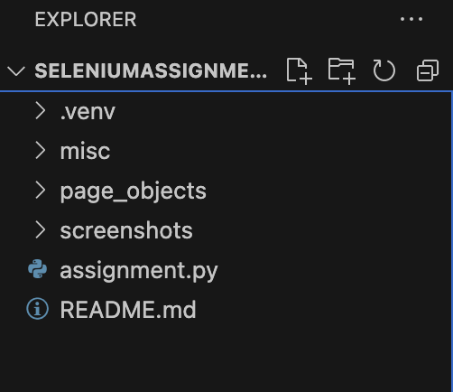
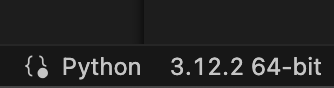
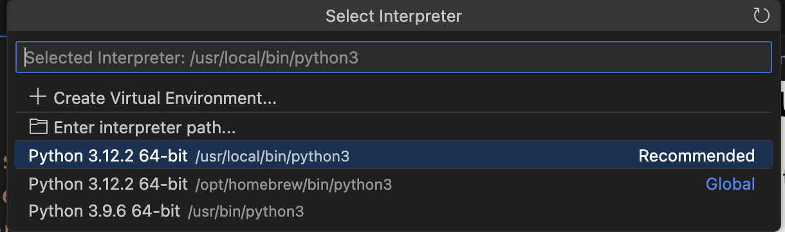
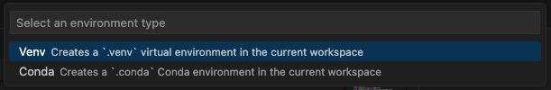
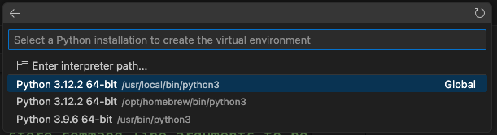
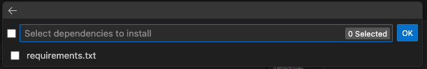
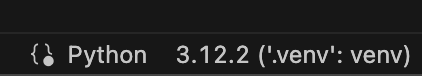
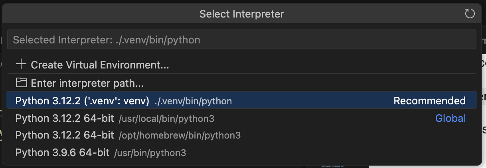
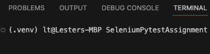
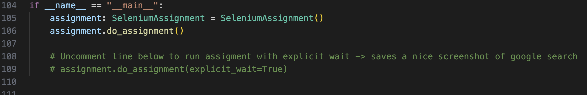

# Selenium Pytest Assignment - Lester
Project files for the assignment.

### Objectives
- Automating the following instructions that takes screenshot of the current Singapore time displayed on Google search and timeanddate.com
    - Navigate to google.com.sg with any browser, I'll be using Chrome
    - Input "Singapore Time" in the search bar, press enter (Key input)
    - Take screenshot
    - Press back
    - Navigate to www.timeanddate.com/worldclock/singapore/singapore
    - Click on Full Screen link text below the clock
    - Take screenshot when it is full screen
    - Quit Browser.

### To run the code
Be sure you have installed Python and have your favourite code editor installed. I'll be using VS code.

With a fresh instance of VS code or other editors supporting Python, open / drag the folder `SeleniumAssignment-Lester` into the workspace. You might want to ensure you have no other workspace / folders opened before opening it.

Your workspace may look similar to this:

Create a local Python version environment in the workspace (If you already know how then skip this after doing it):

* Open any `.py` file in the project
* On your bottom right corner (VScode)

* Click on the version number / "select an interpreter" if yours reflects that and you should see

* Click on "Create Virtual Environment"
* Select `Venv`

* Choose an installation, you can choose the one marked Global

* You can choose to select the `requirements.txt` to install the dependencies used in this project. If you chose this you can skip the installing dependencies step below. Otherwise click OK.

* If there's a prompt asking to select the newly created virtual environment on the bottom right, select it.

If you are interested, you may check this [link](https://realpython.com/python-virtual-environments-a-primer/) on why we should use Python virtual environments for every project.

Be sure that the Python interpreter for the environment is selected for the project (check bottom right of VScode):

if it doesn't reflect `".venv": venv` click on it and select:

Also make sure `(.venv)` appears in your terminal. You may have to kill your existing terminal by clicking on the bin and open a new one. If it doesn't appear give it awhile to reflect before killing it again and opening a new terminal.

#### Installing dependencies

If you didn't select the `requirements.txt` file during the setup of the virtual environment, install the dependencies listed in `requirements.txt` by running:

`pip3 install -r requirements.txt` or `pip install -r requirements.txt`

#### Running the project
Before running the project, open up `assignment.py` and scroll to the bottom.

This is where the program starts. Feel free to run the file with or without the last line commented and observe how the screenshot differs.

To run the program, you may click `run python file` from the top right menu on VSCode or run the following in the terminal:
`python3 assignment.py` / `python assignment.py`

Screenshots from running both `explicit_wait = True` and `explicit_wait = False` are located in `screenshots\screenshots_with_explicit_wait` and `screenshots\screenshots_without_explicit_wait` respectively.